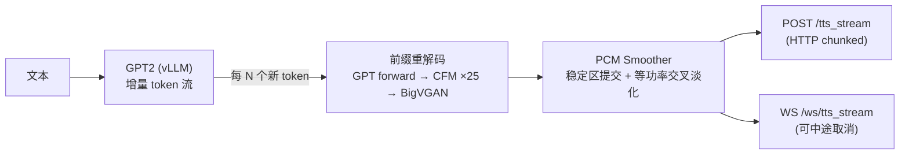

<a href="README.md">中文</a> ｜ <a href="README_EN.md">English</a>

<div align="center">

# IndexTTS-vLLM · 流式推理版

**IndexTTS2 的 token 级流式推理：首音频延迟 4 s → 0.37 s**

[](docs/indextts2-streaming-results.md)
[](#流式-tts仅-indextts2api_server_v2py)
[](test/)

本仓库 fork 自 [Ksuriuri/index-tts-vllm](https://github.com/Ksuriuri/index-tts-vllm)（vLLM 加速版 IndexTTS），
在其之上**设计并实现了完整的流式推理层**。

</div>

## ✨ 流式推理（本 Fork 的核心工作）

IndexTTS2 原生推理必须等整句 token 生成完毕再解码音频，客户端要等约 4 秒才能听到第一个字。
本 Fork 将推理管线改造为 **token 级流式**：GPT 每产出一批声学 token，就把当前前缀重新解码并把新增的稳定音频立即推给客户端。



### 实测效果（RTX 4090，约 24 s 中文音频，3 次取中位）

| 模式 | 首音频延迟 TTFA | RTF | 说明 |
| --- | --- | --- | --- |
| 非流式 `/tts_url` | ~4020 ms | 0.17 | 必须等整句合成完 |
| 流式（冷缓存） | ~830 ms | 0.31 | 该说话人首次请求 |
| 流式（热缓存） | ~600 ms | 0.31 | 首包快 6.7 倍 |
| **流式（热缓存 + 首块 10 步 + 增量解码，默认）** | **~365 ms** | 0.25 | **首包快 11 倍** |

### 设计要点

- **前缀重解码 + 稳定区提交**：CFM/BigVGAN 对 token 前缀整体重解码，只提交尾部 93 ms "不稳定区"之前的音频；不稳定区在下一轮携带更多右侧上下文重解码，与已提交音频做等功率交叉淡化——无爆音、无重复、无缺尾（实测边界跳变均值 ≤ 0.014 满幅，零削波）
- **双传输共享一套引擎流**：HTTP chunked 与 WebSocket 消费同一个 `stream_infer()` 异步生成器；WS 协议为 JSON `start` → 二进制 PCM 帧 → JSON `end`（含 TTFA/RTF 等服务端指标），支持 `{"type":"cancel"}` 中途取消并级联到 vLLM `abort()`
- **说话人条件缓存**：参考音频的 w2v-bert / campplus / length-regulator 条件按 `(路径, mtime)` LRU 缓存，全入口（HTTP/WS/非流式/WebUI）共享互通，TTFA 再降 ~250 ms
- **增量前缀解码**：已生成的 mel 缓存后作为 CFM 的干净 prompt（拼在说话人参考之后），每轮只对「重做 16 帧 + 新增帧」做 25 步扩散；BigVGAN 同样只声码新增窗口并与波形缓存精确拼接——消除前缀重解码的 O(n²) 主项，质量与全量重解码等价（同 token 能量轮廓相关 0.96）
- **自然背压**：vLLM 产 token 快于前缀解码，每轮解码自动吸收更多增量，吞吐不因流式塌陷
- **TDD 全覆盖**：67 项 CPU 单测（fake vLLM / fake 引擎注入）+ 可复现的 GPU 基准脚本

📄 完整架构、逐轮迭代数据与已知限制：[docs/indextts2-streaming-results.md](docs/indextts2-streaming-results.md)

## 🗺️ Roadmap

**流式能力（本 Fork）**

- [x] Token 级流式推理（HTTP chunked + WebSocket）
- [x] 请求级取消（WS cancel → vLLM abort）与服务端指标上报
- [x] 说话人条件 LRU 缓存（TTFA 732 ms → 605 ms）
- [x] 首块低步数 CFM（首个前缀解码 25 → 默认 15 步，API 可调 5–25）：TTFA 660 → 467 ms，10 步可至 ~365 ms
- [x] 增量前缀解码（缓存 mel 作 CFM prompt + 窗口化 BigVGAN）：流式 RTF 0.28 → 0.25；剖析显示剩余瓶颈为参考音频的固定 prompt 开销
- [x] 流式容器选项：`format=pcm|wav|ogg_opus`，WAV 头 / ffmpeg 实时 Opus 转码，浏览器 `<audio>` 直接可播
- [ ] 参考音频上传 / URL 接口（跨机调用免共享文件系统）
- [x] OpenAI 兼容流式接口 `/v1/audio/speech`（官方 openai SDK 流式实测通过）
- [x] 并发流式压测：聚合吞吐随并发翻倍，实用上限 ~4 路（s2mel 串行是瓶颈，见下）
- [ ] API Key 鉴权与速率限制
- [ ] Dockerfile / docker-compose 一键部署

**继承自上游**

- [ ] V2 api 并发优化：目前只有 gpt2 推理并行，s2mel（DiT 25 步迭代）串行，影响并发
- [ ] s2mel 推理加速

## 项目简介（上游能力）

上游项目在 [index-tts](https://github.com/index-tts/index-tts) 的基础上使用 vllm 库重新实现了 gpt 模型的推理，加速了 index-tts 的推理过程。

推理速度（Index-TTS-v1/v1.5）在单卡 RTX 4090 上的提升为：
- 单个请求的 RTF (Real-Time Factor)：≈0.3 -> ≈0.1
- 单个请求的 gpt 模型 decode 速度：≈90 token / s -> ≈280 token / s
- 并发量：gpu_memory_utilization 设置为 0.25（约5GB显存）的情况下，实测 16 左右的并发无压力（测速脚本参考 `simple_test.py`）

<details>
<summary><b>上游更新日志（点击展开）</b></summary>

- **[2025-09-22]** 支持了 vllm v1 版本，IndexTTS2 正在兼容中
- **[2025-09-28]** 支持了 IndexTTS2 的 webui 推理，并整理了权重文件，现在部署更加方便了！ \0.0/ ；但当前版本对于 IndexTTS2 的 gpt 似乎并没有加速效果，待研究
- **[2025-09-29]** 解决了 IndexTTS2 的 gpt 模型推理加速无效的问题
- **[2025-10-09]** 兼容 IndexTTS2 的 api 接口调用，请参考 [API](#api)；v1/1.5 的 api 接口以及 openai 兼容的接口可能还有 bug，晚点再修
- **[2025-10-19]** 支持 qwen0.6bemo4-merge 的 vllm 推理
- **[2026-03-03]** vllm 0.16.0 support for gpt2 inference

</details>

**本 Fork 更新**

- **[2026-07-27]** IndexTTS2 token 级流式推理上线：HTTP/WS 双传输、取消、指标（TTFA ~730 ms）
- **[2026-07-27]** 说话人条件缓存：热缓存 TTFA 降至 ~600 ms，全入口共享
- **[2026-07-28]** 首块低步数 CFM：request 首个前缀解码默认 15 步（可调 5–25），后续轮次全步数；热缓存 TTFA 降至 ~470 ms
- **[2026-07-29]** 首块默认步数 15 → 10（试听验证无差异），默认配置 TTFA 降至 ~362 ms
- **[2026-07-29]** 流式容器（WAV/Ogg-Opus）+ OpenAI 兼容流式接口 + 并发压测（实用并发 ~4 路）
- **[2026-07-29]** 增量前缀解码：mel 缓存复用为 CFM prompt + 窗口化 BigVGAN，流式 RTF 0.28 → 0.25，TTFA 与音质不变；含每轮阶段耗时剖析与参考截短负结果

## 使用步骤

### 1. clone 本项目
```bash
git clone https://github.com/yangohuang/index-tts-vllm.git
cd index-tts-vllm
```

### 2. 创建并激活 conda 环境
```bash
conda create -n index-tts-vllm python=3.12
conda activate index-tts-vllm
```

### 3. 安装依赖
使用强制覆盖的方式进行依赖安装，规避vllm 0.16.0与descript-audiotools 0.7.2版本中protobuf的版本冲突问题。
```bash
pip install uv
uv pip install -r requirements.txt -c overrides.txt
```

### 4. 下载模型权重

#### 自动下载（推荐）

选择对应版本的模型权重下载到 `checkpoints/` 路径下：

**From ModelScope（国内推荐）：**

```bash
# Index-TTS
modelscope download --model kusuriuri/Index-TTS-vLLM --local_dir ./checkpoints/Index-TTS-vLLM

# IndexTTS-1.5
modelscope download --model kusuriuri/Index-TTS-1.5-vLLM --local_dir ./checkpoints/Index-TTS-1.5-vLLM

# IndexTTS-2
modelscope download --model kusuriuri/IndexTTS-2-vLLM --local_dir ./checkpoints/IndexTTS-2-vLLM
```

**From Hugging Face：**

```bash
# IndexTTS-2
huggingface-cli download ksuriuri/IndexTTS-2-vLLM --local-dir ./checkpoints/IndexTTS-2-vLLM
```

#### 手动下载

- ModelScope：[Index-TTS](https://www.modelscope.cn/models/kusuriuri/Index-TTS-vLLM) | [IndexTTS-1.5](https://www.modelscope.cn/models/kusuriuri/Index-TTS-1.5-vLLM) | [IndexTTS-2](https://www.modelscope.cn/models/kusuriuri/IndexTTS-2-vLLM)
- Hugging Face：[IndexTTS-2](https://huggingface.co/ksuriuri/IndexTTS-2-vLLM)

#### 自行转换原权重（可选，不推荐）

可以使用 `convert_hf_format.sh` 自行转换官方权重文件：

```bash
bash convert_hf_format.sh /path/to/your/model_dir
```

### 5. 启动！

**API 服务（含流式接口，推荐）：**

```bash
python api_server_v2.py --model_dir checkpoints/IndexTTS-2-vLLM --is_fp16 \
  --gpu_memory_utilization 0.25 --qwenemo_gpu_memory_utilization 0.10
# 等 GET /health 返回 200（约 40 秒）即可调用
```

**WebUI（第一次启动可能会久一些，因为要对 bigvgan 进行 cuda 核编译）：**

```bash
# Index-TTS 1.0
python webui.py

# IndexTTS-1.5
python webui.py --version 1.5

# IndexTTS-2
python webui_v2.py
```

## API

使用 fastapi 封装了 api 接口，启动示例如下：

```bash
# Index-TTS-1.0/1.5
python api_server.py

# IndexTTS-2（含流式接口）
python api_server_v2.py
```

### 启动参数
- `--model_dir`: 必填，模型权重路径
- `--host`: 服务ip地址，默认为 `0.0.0.0`
- `--port`: 服务端口，默认为 `6006`
- `--gpu_memory_utilization`: vllm 显存占用率，默认设置为 `0.25`

### API 请求示例
- v1/1.5 请参考 `api_example.py`
- v2 请参考 `api_example_v2.py`

### 流式 TTS（仅 IndexTTS2，`api_server_v2.py`）

`/tts_stream`（HTTP）与 `/ws/tts_stream`（WebSocket）以 token 为粒度流式返回音频：

- 输出为**无文件头**的 22050 Hz 单声道 PCM16 小端（`pcm_s16le`）裸流。
- `stream_chunk_tokens` 有效范围 **10–100**（默认 20）：值越小首包延迟（TTFA）越低，但总吞吐越差（前缀会被更频繁地重解码）。
- `first_chunk_diffusion_steps` 有效范围 **5–25**（默认 10，试听验证与 25 步无可辨差异）：仅 request 的首个前缀解码使用的 CFM 步数，后续轮次固定 25 步。步数越低首包越快、开头约 0.4 s 音质略降；设为 25 即关闭该优化。
- 情感文本模式（`emo_control_method=3`）会先调用 Qwen 情感模型，增加流式开始前的预处理延迟。
- `format` 可选 `pcm`（默认）/ `wav`（带 RIFF 头，浏览器可直接播）/ `ogg_opus`（ffmpeg 实时转码）。
- 原有 `/tts_url` 接口保持不变，仍返回完整 WAV。

**OpenAI 兼容**：`POST /v1/audio/speech`（`voice` 传参考音频路径，`response_format` 支持 `wav`/`pcm`/`opus`）：

```python
from openai import OpenAI
client = OpenAI(base_url="http://127.0.0.1:6006/v1", api_key="unused")
with client.audio.speech.with_streaming_response.create(
    model="index-tts-2", voice="assets/jay_promptvn.wav",
    input="你好，世界", response_format="wav",
) as response:
    for chunk in response.iter_bytes():
        play_or_buffer(chunk)
```

HTTP 示例（curl，输出为裸 PCM，可用 ffplay 播放）：

```bash
curl -sN http://127.0.0.1:6006/tts_stream \
  -H "Content-Type: application/json" \
  -d '{"text": "你好，世界", "spk_audio_path": "assets/jay_promptvn.wav", "stream_chunk_tokens": 20}' \
  | ffplay -f s16le -ar 22050 -ch_layout mono -i - -autoexit -nodisp
```

HTTP 示例（Python）：

```python
import httpx

with httpx.stream("POST", "http://127.0.0.1:6006/tts_stream", json={
    "text": "你好，世界",
    "spk_audio_path": "assets/jay_promptvn.wav",
    "stream_chunk_tokens": 20,
}, timeout=180) as response:
    response.raise_for_status()
    for pcm_chunk in response.iter_bytes():
        play_or_buffer(pcm_chunk)  # 22050 Hz 单声道 PCM16 LE
```

WebSocket 示例（Python，支持中途取消）：

```python
import asyncio, json
import websockets

async def synthesize():
    async with websockets.connect("ws://127.0.0.1:6006/ws/tts_stream") as ws:
        await ws.send(json.dumps({
            "type": "synthesize",
            "request_id": "demo-1",
            "text": "你好，世界",
            "spk_audio_path": "assets/jay_promptvn.wav",
            "stream_chunk_tokens": 20,
        }))
        while True:
            message = await ws.recv()
            if isinstance(message, bytes):
                play_or_buffer(message)  # 二进制帧：PCM16 LE 音频
                continue
            event = json.loads(message)  # JSON 帧：start / end / error
            if event["type"] == "end":
                print("metrics:", event["metrics"])
                break
        # 合成中途发送 {"type": "cancel"} 可取消，end 消息中 cancelled 为 true

asyncio.run(synthesize())
```

基准测试客户端参考 [`test/integration_streaming_v2.py`](test/integration_streaming_v2.py)。

### OpenAI API
- 添加 /audio/speech api 路径，兼容 OpenAI 接口
- 添加 /audio/voices api 路径， 获得 voice/character 列表

详见：[createSpeech](https://platform.openai.com/docs/api-reference/audio/createSpeech)

## 新特性
- **v1/v1.5:** 支持多角色音频混合：可以传入多个参考音频，TTS 输出的角色声线为多个参考音频的混合版本（输入多个参考音频会导致输出的角色声线不稳定，可以抽卡抽到满意的声线再作为参考音频）

## 性能
Word Error Rate (WER) Results for IndexTTS and Baseline Models on the [**seed-test**](https://github.com/BytedanceSpeech/seed-tts-eval)

| model                   | zh    | en    |
| ----------------------- | ----- | ----- |
| Human                   | 1.254 | 2.143 |
| index-tts (num_beams=3) | 1.005 | 1.943 |
| index-tts (num_beams=1) | 1.107 | 2.032 |
| index-tts-vllm      | 1.12  | 1.987 |

基本保持了原项目的性能

## 测试

```bash
# CPU 单元测试（流式原语 / token 流 / 引擎 / API 协议 / 缓存，无需 GPU）
python -m pytest test -v

# 流式 GPU 基准（需先启动 API 服务）
python test/integration_streaming_v2.py --transport websocket \
  --text "……足够长的段落……" --output-wav out.wav

# 并发压测（非流式）
python simple_test.py
```
