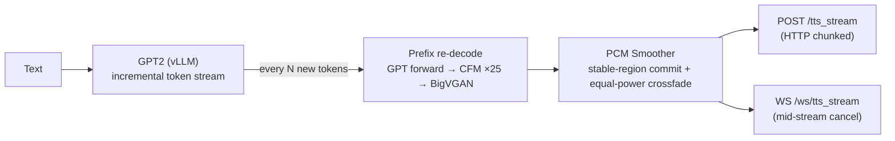

<a href="README.md">中文</a> ｜ <a href="README_EN.md">English</a>

<div align="center">

# IndexTTS-vLLM · Streaming Edition

**Token-level streaming inference for IndexTTS2: time-to-first-audio 4 s → 0.37 s**

[](docs/indextts2-streaming-results.md)
[](#streaming-tts-indextts2-only-api_server_v2py)
[](test/)

Forked from [Ksuriuri/index-tts-vllm](https://github.com/Ksuriuri/index-tts-vllm) (the vLLM-accelerated IndexTTS),
this fork **designs and implements a complete streaming inference layer** on top of it.

</div>

## ✨ Streaming Inference (this fork's core work)

Native IndexTTS2 inference must finish generating all tokens of a sentence before decoding any audio, so clients wait ~4 seconds before hearing the first word. This fork restructures the pipeline into **token-level streaming**: each time the GPT emits a batch of acoustic tokens, the current prefix is re-decoded and the newly stabilized audio is pushed to the client immediately.



### Measured results

**Terminology first**:

- **TTFA** (Time To First Audio): elapsed time from sending the request to receiving the first playable audio. The key UX metric for dialog / digital-human use — it is the silence before a reply starts.
- **RTF** (Real-Time Factor): synthesis time ÷ audio duration. RTF 0.25 means 10 s of audio takes 2.5 s to synthesize; anything below 1 can play while synthesizing, and lower RTF means more concurrent streams per GPU.
- **Cold / warm cache**: every request first extracts speaker features from the reference audio (~250 ms). This fork caches those features per file — the **first** request with a given reference pays the cost (cold), every later request with the same reference hits the cache (warm). Production voices are usually fixed, so warm is the steady state.

Setup: single RTX 4090, ~130-character Chinese text (~24 s of audio), median of 3 runs after one discarded warmup. Rows below stack the optimizations in order; **the last row is the current default**:

| Mode | TTFA | RTF | Notes |
| --- | --- | --- | --- |
| Non-streaming `/tts_url` (original) | ~4020 ms | 0.17 | returns only after full synthesis — a 4 s wait |
| Streaming, cold cache | ~830 ms | 0.31 | synthesize-while-sending; includes ~250 ms feature extraction |
| Streaming, warm cache | ~600 ms | 0.31 | speaker features served from cache |
| Streaming, warm cache + 10-step first chunk | ~467→365 ms | 0.31 | only the **first** chunk uses 10 diffusion steps instead of 25 (no audible difference); later chunks unaffected |
| **Streaming + incremental decoding (current default)** | **~365 ms** | **0.25** | already-synthesized audio is never re-decoded; ~10% faster synthesis, quality verified lossless by same-token comparison and listening |

In one sentence: **first audio drops from 4 s to 0.37 s (11× faster), and synthesis runs 4× faster than real time throughout.** Streaming RTF (0.25) being higher than non-streaming (0.17) is the inherent cost of streaming decode, traded for first audio arriving 3.6 s earlier.

### Design highlights

- **Prefix re-decode + stable-region commit**: CFM/BigVGAN re-decode the whole token prefix, but only audio before the trailing 93 ms "unstable region" is committed; that region is re-decoded next round with more right context and crossfaded (equal-power) against committed audio — no clicks, no repeats, no missing tails (measured boundary discontinuity mean ≤ 0.014 FS, zero clipping)
- **Two transports, one engine stream**: HTTP chunked and WebSocket consume the same `stream_infer()` async generator; the WS protocol is JSON `start` → binary PCM frames → JSON `end` (with server-side TTFA/RTF metrics), and `{"type":"cancel"}` cancels mid-stream, cascading to vLLM `abort()`
- **Speaker-conditioning cache**: the reference audio's w2v-bert / campplus / length-regulator conditioning is LRU-cached by `(path, mtime)`, shared across all entry points (HTTP/WS/non-streaming/WebUI), cutting another ~250 ms off TTFA
- **Natural backpressure**: vLLM produces tokens faster than prefix decoding consumes them, so each decode round absorbs a larger increment — throughput does not collapse under streaming
- **TDD throughout**: 67 CPU unit tests (fake vLLM / fake engine injection) + a reproducible GPU benchmark client

📄 Full architecture, per-iteration measurements, and known limitations: [docs/indextts2-streaming-results.md](docs/indextts2-streaming-results.md)

## 🗺️ Roadmap

**Streaming (this fork)**

- [x] Token-level streaming inference (HTTP chunked + WebSocket)
- [x] Per-request cancellation (WS cancel → vLLM abort) and server-side metrics
- [x] Speaker-conditioning LRU cache (TTFA 732 ms → 605 ms)
- [x] Low-step CFM for the first chunk (first prefix decode 25 → default 15 steps, API-tunable 5–25): TTFA 660 → 467 ms, ~365 ms at 10 steps
- [x] Incremental prefix decoding (cached mel as CFM prompt + windowed BigVGAN): streaming RTF 0.28 → 0.25; profiling shows the fixed reference-prompt cost is the remaining bottleneck
- [x] Streaming containers: `format=pcm|wav|ogg_opus` (RIFF header / realtime ffmpeg Opus), directly playable in browser `<audio>`
- [ ] Reference-audio upload / URL endpoint (cross-machine calls without a shared filesystem)
- [x] OpenAI-compatible streaming endpoint `/v1/audio/speech` (validated with the official openai SDK)
- [x] Concurrent streaming load test: aggregate throughput doubles with concurrency, practical limit ~4 streams (serial s2mel is the bottleneck)
- [ ] API-key auth and rate limiting
- [ ] Dockerfile / docker-compose one-command deployment

**Inherited from upstream**

- [ ] Concurrency optimization for the V2 API: only gpt2 inference is parallel; s2mel (25 DiT iterations) runs serially and limits concurrency
- [ ] Acceleration of s2mel inference

## Introduction (upstream capabilities)

The upstream project re-implements the GPT model's inference from [index-tts](https://github.com/index-tts/index-tts) using the vllm library, accelerating the inference process of index-tts.

Inference speed improvement (Index-TTS-v1/v1.5) on a single RTX 4090:
- RTF (Real-Time Factor) for a single request: ≈0.3 -> ≈0.1
- GPT model decode speed for a single request: ≈90 tokens/s -> ≈280 tokens/s
- Concurrency: With `gpu_memory_utilization` set to 0.25 (approx. 5GB VRAM), it can handle a concurrency of around 16 without pressure (refer to `simple_test.py` for the benchmark script).

<details>
<summary><b>Upstream update log (click to expand)</b></summary>

- **[2025-09-22]** Added support for vllm v1. Compatibility with IndexTTS2 is in progress.
- **[2025-09-28]** Supported web UI inference for IndexTTS2 and organized the weight files for easier deployment! \0.0/ ; However, the current version doesn't seem to accelerate the GPT of IndexTTS2, which is under investigation.
- **[2025-09-29]** Resolved the issue of ineffective GPT model inference acceleration for IndexTTS2.
- **[2025-10-09]** Compatible with IndexTTS2 API calls, please refer to [API](#api); APIs for v1/1.5 and the OpenAI-compatible interfaces may still have bugs, to be fixed later.
- **[2025-10-19]** Supported vllm inference for qwen0.6bemo4-merge.
- **[2026-03-03]** vllm 0.16.0 support for gpt2 inference

</details>

**This fork's updates**

- **[2026-07-27]** Token-level streaming inference for IndexTTS2: HTTP/WS transports, cancellation, metrics (TTFA ~730 ms)
- **[2026-07-27]** Speaker-conditioning cache: warm-cache TTFA down to ~600 ms, shared across all entry points
- **[2026-07-28]** Low-step CFM for the first chunk: the request's first prefix decode defaults to 15 steps (tunable 5–25), later rounds use full steps; warm-cache TTFA down to ~470 ms
- **[2026-07-29]** First-chunk default steps 15 → 10 (no audible difference in listening tests); default-config TTFA down to ~362 ms
- **[2026-07-29]** Streaming containers (WAV/Ogg-Opus) + OpenAI-compatible streaming endpoint + concurrency load test (~4 practical streams)
- **[2026-07-29]** Incremental prefix decoding: cached mel reused as the CFM prompt + windowed BigVGAN, streaming RTF 0.28 → 0.25 with unchanged TTFA and quality; includes per-stage profiling and a documented negative result on reference trimming

## Usage Steps

### 1. Clone this project
```bash
git clone https://github.com/yangohuang/index-tts-vllm.git
cd index-tts-vllm
```

### 2. Create and activate a conda environment
```bash
conda create -n index-tts-vllm python=3.12
conda activate index-tts-vllm
```

### 3. Install dependencies
Install dependencies with forced overrides to resolve the protobuf version conflict between vllm 0.16.0 and descript-audiotools 0.7.2.
```bash
pip install uv
uv pip install -r requirements.txt -c overrides.txt
```

### 4. Download model weights

#### Automatic Download (Recommended)

Download the corresponding version of the model weights to the `checkpoints/` directory:

**From ModelScope (recommended for users in China):**

```bash
# Index-TTS
modelscope download --model kusuriuri/Index-TTS-vLLM --local_dir ./checkpoints/Index-TTS-vLLM

# IndexTTS-1.5
modelscope download --model kusuriuri/Index-TTS-1.5-vLLM --local_dir ./checkpoints/Index-TTS-1.5-vLLM

# IndexTTS-2
modelscope download --model kusuriuri/IndexTTS-2-vLLM --local_dir ./checkpoints/IndexTTS-2-vLLM
```

**From Hugging Face:**

```bash
# IndexTTS-2
huggingface-cli download ksuriuri/IndexTTS-2-vLLM --local-dir ./checkpoints/IndexTTS-2-vLLM
```

#### Manual Download

- ModelScope: [Index-TTS](https://www.modelscope.cn/models/kusuriuri/Index-TTS-vLLM) | [IndexTTS-1.5](https://www.modelscope.cn/models/kusuriuri/Index-TTS-1.5-vLLM) | [IndexTTS-2](https://www.modelscope.cn/models/kusuriuri/IndexTTS-2-vLLM)
- Hugging Face: [IndexTTS-2](https://huggingface.co/ksuriuri/IndexTTS-2-vLLM)

#### Convert original weights yourself (Optional, not recommended)

You can use `convert_hf_format.sh` to convert the official weight files yourself:

```bash
bash convert_hf_format.sh /path/to/your/model_dir
```

### 5. Launch!

**API server (with streaming endpoints, recommended):**

```bash
python api_server_v2.py --model_dir checkpoints/IndexTTS-2-vLLM --is_fp16 \
  --gpu_memory_utilization 0.25 --qwenemo_gpu_memory_utilization 0.10
# Ready once GET /health returns 200 (~40 s)
```

**Web UI (the first launch may take longer due to CUDA kernel compilation for bigvgan):**

```bash
# Index-TTS 1.0
python webui.py

# IndexTTS-1.5
python webui.py --version 1.5

# IndexTTS-2
python webui_v2.py
```

## API

An API interface is encapsulated using FastAPI. Here is an example of how to start it:

```bash
# Index-TTS-1.0/1.5
python api_server.py

# IndexTTS-2 (with streaming endpoints)
python api_server_v2.py
```

### Startup Parameters
- `--model_dir`: Required, path to the model weights.
- `--host`: Server IP address, defaults to `0.0.0.0`.
- `--port`: Server port, defaults to `6006`.
- `--gpu_memory_utilization`: vllm GPU memory utilization rate, defaults to `0.25`.

### API Request Examples
- For v1/1.5, please refer to `api_example.py`.
- For v2, please refer to `api_example_v2.py`.

### Streaming TTS (IndexTTS2 only, `api_server_v2.py`)

`/tts_stream` (HTTP) and `/ws/tts_stream` (WebSocket) stream audio at token granularity:

- Output is **headerless** 22050 Hz mono PCM16 little-endian (`pcm_s16le`) raw audio.
- Valid `stream_chunk_tokens` range is **10–100** (default 20): smaller values lower time-to-first-audio but reduce overall throughput (the prefix is re-decoded more often).
- Valid `first_chunk_diffusion_steps` range is **5–25** (default 10, validated by listening against 25 steps): CFM steps used only for the request's first prefix decode; later rounds always use 25. Lower values cut TTFA at a slight quality cost in the opening ~0.4 s; 25 disables the optimization.
- Emotion-text mode (`emo_control_method=3`) first calls the Qwen emotion model, adding preprocessing latency before streaming starts.
- The existing `/tts_url` endpoint is unchanged and still returns a complete WAV response.

HTTP example (curl; raw PCM output playable with ffplay):

```bash
curl -sN http://127.0.0.1:6006/tts_stream \
  -H "Content-Type: application/json" \
  -d '{"text": "Hello world", "spk_audio_path": "assets/jay_promptvn.wav", "stream_chunk_tokens": 20}' \
  | ffplay -f s16le -ar 22050 -ch_layout mono -i - -autoexit -nodisp
```

HTTP example (Python):

```python
import httpx

with httpx.stream("POST", "http://127.0.0.1:6006/tts_stream", json={
    "text": "Hello world",
    "spk_audio_path": "assets/jay_promptvn.wav",
    "stream_chunk_tokens": 20,
}, timeout=180) as response:
    response.raise_for_status()
    for pcm_chunk in response.iter_bytes():
        play_or_buffer(pcm_chunk)  # 22050 Hz mono PCM16 LE
```

WebSocket example (Python, supports mid-stream cancel):

```python
import asyncio, json
import websockets

async def synthesize():
    async with websockets.connect("ws://127.0.0.1:6006/ws/tts_stream") as ws:
        await ws.send(json.dumps({
            "type": "synthesize",
            "request_id": "demo-1",
            "text": "Hello world",
            "spk_audio_path": "assets/jay_promptvn.wav",
            "stream_chunk_tokens": 20,
        }))
        while True:
            message = await ws.recv()
            if isinstance(message, bytes):
                play_or_buffer(message)  # binary frames: PCM16 LE audio
                continue
            event = json.loads(message)  # JSON frames: start / end / error
            if event["type"] == "end":
                print("metrics:", event["metrics"])
                break
        # Send {"type": "cancel"} mid-synthesis to cancel; the end message then has cancelled=true

asyncio.run(synthesize())
```

See [`test/integration_streaming_v2.py`](test/integration_streaming_v2.py) for a benchmark client.

### OpenAI API
- Added `/audio/speech` API path for compatibility with the OpenAI interface.
- Added `/audio/voices` API path to get the list of voices/characters.

For details, see: [createSpeech](https://platform.openai.com/docs/api-reference/audio/createSpeech)

## New Features
- **v1/v1.5:** Supports multi-character audio mixing: You can input multiple reference audios, and the TTS output voice will be a mix of these reference audios. (Inputting multiple reference audios may lead to an unstable output voice; you can try multiple times to get a satisfactory voice and then use it as a reference audio).

## Performance
Word Error Rate (WER) Results for IndexTTS and Baseline Models on the [**seed-test**](https://github.com/BytedanceSpeech/seed-tts-eval)

| model                   | zh    | en    |
| ----------------------- | ----- | ----- |
| Human                   | 1.254 | 2.143 |
| index-tts (num_beams=3) | 1.005 | 1.943 |
| index-tts (num_beams=1) | 1.107 | 2.032 |
| index-tts-vllm          | 1.12  | 1.987 |

Maintains the performance of the original project.

## Testing

```bash
# CPU unit tests (streaming primitives / token stream / engine / API protocol / cache; no GPU needed)
python -m pytest test -v

# Streaming GPU benchmark (start the API server first)
python test/integration_streaming_v2.py --transport websocket \
  --text "...a sufficiently long paragraph..." --output-wav out.wav

# Concurrency load test (non-streaming)
python simple_test.py
```
